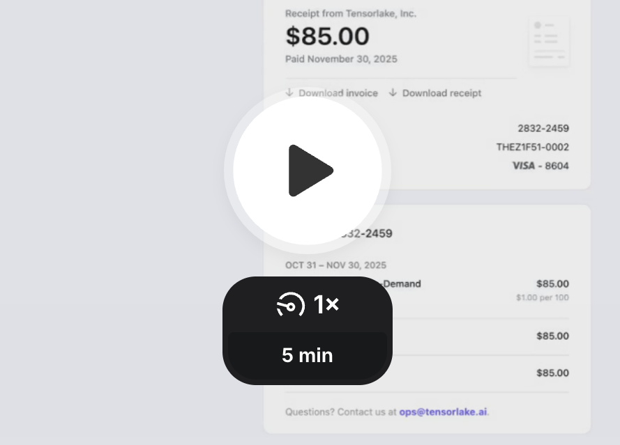
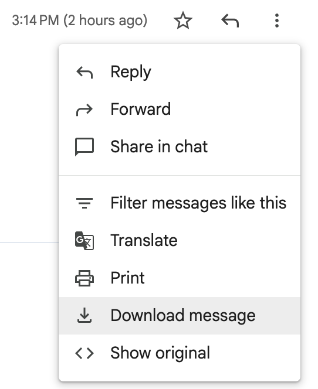
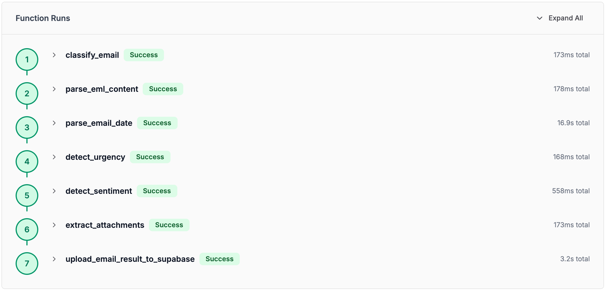

# Email Classifier

This sample shows how to deploying a **Production-Ready Email Classifier with TensorLake**.

<a href="https://www.loom.com/share/cb5f140fbc6146568a1608e1f00169dc">
  
</a><br />

[Watch the demo in Loom](https://www.loom.com/share/cb5f140fbc6146568a1608e1f00169dc)

---

## Project Description

### Prerequisites 
- Signup at [Tensorlake Cloud](https://cloud.tensorlake.ai) to setup an api key
- Get the [Tensorlake SDK](https://github.com/tensorlakeai/tensorlake) to deploy applications
- Use `tensorlake login` with the SDK
- Finally `tensorlake deploy email-classifier.py`

**Download an email**<br />


### Running the Application

```bash
EML_BASE64=$(base64 -i "<path_to_email>")
curl https://api.tensorlake.ai/applications/classify_email \
 -H "Authorization: Bearer $TENSORLAKE_API_KEY" \
 -H "Content-Type: application/json" \
 -H "Accept: application/json" \
 -d "{\"content\": \"$EML_BASE64\", \"content_type\": \"message/rfc822\"}"
```

### Review in Cloud UI


